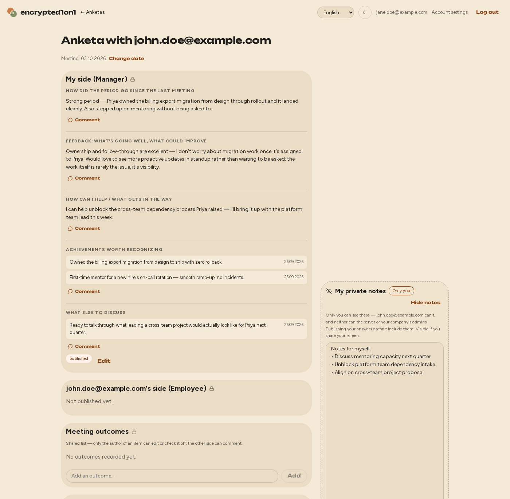

# encrypted1on1

[](https://github.com/aleksejs1/encrypted1on1/actions/workflows/ci.yml)

A self-hosted, end-to-end encrypted platform for running 1:1 meetings between managers and employees.



More: [screenshots](docs/screenshots/) — login, the anketa list, a filled-in anketa, the report view, dark mode, all 4 languages, and a look at what the server's own API response actually contains.

## Status

Feature-complete and styled: authentication, invites and open self-registration (invite-only, admin-only, or double-opt-in self-registration restricted to an email domain — configurable), password reset and account settings (in-app password change, notification preferences, data export, account deletion), end-to-end encrypted 1:1 cycles (questions, comments, shared outcomes, goals with progress checkpoints), a grouped anketa-list view with per-counterpart mood/workload trend charts, reminder emails, an admin panel, a cross-period report view, 4-language i18n, dark mode, installable as a home-screen app (Web App Manifest), a CSP+Subresource-Integrity-hardened build with explicit HSTS, and a full production deployment path (including running behind an existing reverse proxy). See `CLAUDE.md`'s "Current stage" section for the exact up-to-date state of ongoing work — kept there, not duplicated here, so this file doesn't go stale the same way again.

## Core idea

- **Self-hosted.** Your company runs it, your data stays on your own infrastructure.
- **End-to-end encrypted.** 1:1 content is encrypted client-side; the server only ever stores ciphertext derived from each user's password. Not even whoever operates the server can read it.
- **Open source.** Licensed under AGPLv3, so the privacy claims above can actually be verified by reading the code, not just taken on faith.

## Documentation

- **[docs/](docs/)** — start here: [how the encryption works](docs/encryption.md), the [1:1 methodology](docs/methodology.md) behind it, the [user flow](docs/user-flow.md) it produces, the [application architecture](docs/architecture.md), and [how to deploy it](docs/deployment.md) (dev, both production setups, and a full [configuration reference](docs/deployment.md#configuration)).
- **[CLAUDE.md](CLAUDE.md)** — development notes for anyone working on the codebase itself.

## Quick start (dev)

```
make up          # starts the backend (FrankenPHP) and Mailpit
cd frontend
npm install
npm run dev      # frontend dev server, proxies API calls to the backend
```

`make down` stops the backend/Mailpit containers; `make test`/`make lint`/`make coverage` run the backend+frontend test suites against the running dev stack, `make test-backend-isolated` (plus `lint-`/`coverage-backend-isolated`) run the backend suite in a fully separate, one-shot stack with its own database instead — no dev stack required — and `make e2e` runs the dual-actor Playwright suite against its own genuinely isolated stack (`make e2e-down` to tear it down afterward) (see [docs/architecture.md](docs/architecture.md#testing-and-ci)). See [docs/deployment.md](docs/deployment.md) for the full picture, including production.

## Git hooks

```
git config core.hooksPath .githooks
```

One-time, per clone (not committed by git itself). `.githooks/pre-commit` autofixes and re-stages formatting on whatever's actually staged (`php-cs-fixer`/Prettier — skipped with a warning, not blocked, if the dev stack/`node_modules` aren't ready) plus a whitespace/conflict-marker check; `.githooks/pre-push` runs a typecheck (`composer stan`/`npm run check`), scoped to whichever of `backend/`/`frontend/` actually changed since the push target. Both stay fast on purpose — CI and `make test`/`make lint`/`make coverage` own the exhaustive checks, the hooks just catch the cheap stuff before it leaves your machine.

## License

AGPLv3 — see [LICENSE](LICENSE).

## Contributing

Not currently set up for external contributions (no issue templates, no contribution guidelines yet) — open an issue first if you're interested, rather than sending an unsolicited PR.
