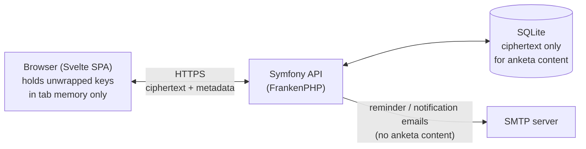

# Architecture

How the system is put together. For what the encryption actually does, see [encryption.md](encryption.md). For how to run it, see [deployment.md](deployment.md).

## Tech stack

| Layer | Choice | Notes |
|---|---|---|
| Backend | Symfony (PHP 8.4), hand-composed | No `symfony/skeleton` — deliberately fewer moving parts |
| Backend API layer | Custom controllers | Real logic per endpoint, not generic CRUD (one narrow exception below) |
| Database | SQLite | Single-tenant, self-hosted; no need for a separate DB server |
| App server | [FrankenPHP](https://frankenphp.dev/) (built on Caddy) | Serves PHP and the built frontend from one process/container |
| Frontend | Svelte 5 + TypeScript + Vite | Runes (`$state`/`$derived`/`$effect`), no SSR — a plain SPA |
| Frontend crypto | [libsodium-wrappers-sumo](https://github.com/jedisct1/libsodium.js) + WebCrypto | See encryption.md |
| Auth | Server-side session (httpOnly, `SameSite=Strict` cookie), CSRF-protected | Not JWT — no client-side token storage/refresh logic needed |
| i18n | `svelte-i18n` (frontend), Symfony Translation (backend emails/errors) | 4 languages: English, Russian, Latvian, Spanish |
| Mail | Symfony Mailer, any SMTP DSN | Mailpit in dev, real SMTP in prod |
| Error tracking | Sentry (`sentry/sentry-symfony`), opt-in via `SENTRY_DSN` | Backend only, empty DSN = disabled (see [deployment.md](deployment.md)); no frontend error tracking yet |

## High-level shape



The server is a single deployable unit: one FrankenPHP process serves the built SPA's static files *and* the `/api/*` JSON endpoints, backed by one SQLite file. There's no separate frontend host, no message queue, no background worker process — see "What's deliberately not here" below for why.

## Directory layout

```
backend/
  src/Controller/    one file per resource area (Auth, Activation, Anketa, Admin, Invite, Report, ...)
  src/Entity/         Doctrine entities (User, Anketa, Goal, ActivationToken, ...)
  src/EventListener/  cross-cutting concerns (JSON error responses, request-locale resolution)
  src/Http/           small shared helpers (e.g. rate-limit response formatting)
  src/Notification/   email-sending logic
  src/Security/       session/CSRF helpers
  tests/              PHPUnit — Functional (HTTP-level, per controller) + Unit (entity logic) + Architecture (structural rules, see below)

frontend/
  src/crypto/   every cryptographic operation — see encryption.md, this is the module to audit
  src/anketa/   the anketa domain: questions, comments, outcomes, goals (pure logic + UI)
  src/pages/    one Svelte component per route
  src/admin/    admin-only UI
  src/design/   design-system tokens/components/shared layout pieces
  src/i18n/     locale files + language switcher

docker/         Dockerfiles and Caddy configs for both dev and prod
docs/           you are here
```

## Request/session model

Every request from the frontend goes through `src/api/client.ts`, which attaches the session cookie (browser-managed, not touched by app code) and a CSRF token (fetched once, sent as a header) and an `X-Locale` header (so backend-generated error messages come back in the active UI language). The backend has no JWT issuance/refresh logic at all — a session is either valid (cookie present, not expired, account not blocked) or it isn't.

`GET /api/users` is the one resource exposed through API Platform rather than a hand-written controller — it's genuinely a plain read-only list (needed for the counterpart picker), and neither field it returns (`isAdmin`, `isBlocked`) is sensitive. Every other endpoint is a hand-written controller method with real per-request authorization logic (e.g. "is the requester a participant in this anketa"), not a generic resource pattern.

## What the server is trusted to enforce vs. what it structurally cannot see

This is the boundary the whole design sits on top of, so it's worth stating explicitly here too (full detail in encryption.md):

- **The server fully controls**: who can log in, who's an admin, who's blocked, which two accounts are paired in an anketa, rate limits, email delivery — which is also the full extent of what a company admin's reporting endpoints (`AdminReportController`) can aggregate into company-wide meeting/goal counts and trend charts; nothing new is exposed, they just read what the server already controls.
- **The server cannot see, even if compromised**: anketa answers, comments, outcome text, goal checkpoint text, any password, any encryption key. A small, backend test suite enforcement (`backend/tests/Architecture/SerializationBoundaryTest.php`) checks this structurally on every CI run — it fails the build if a ciphertext-bearing field ever gains a serialization group that would expose it over the API, or if a second entity ever gets wired into the generic API-Platform resource layer without the same scrutiny.
- **If the server itself is compromised**, the browser is the last line of defense: a strict Content-Security-Policy (`docker/prod/Caddyfile`, no `unsafe-inline`, `'wasm-unsafe-eval'` only because the crypto library is real WebAssembly) plus Subresource Integrity on the built JS/CSS (`frontend/scripts/inject-sri.mjs`) mean a tampered server can't silently swap out the crypto code that runs client-side without the browser refusing to execute it.

## Testing and CI

Centralized `Makefile` targets (`make test`/`make lint`/`make coverage`/`make e2e`, or the `-backend`/`-frontend` suffixed halves individually) wrap the underlying commands below — nothing new in the commands themselves, just one place that doesn't need remembering each one's exact incantation. Backend targets need `make up` first (they `exec` into the running dev container); frontend targets run on the host and need `cd frontend && npm install` first.

- **Backend**: PHPUnit (`composer test` — functional tests drive the real HTTP layer via `symfony/browser-kit`, unit tests cover entity logic with no kernel boot), PHPStan at max level for `src/`, level 8 for `tests/` (`composer stan`), PHP-CS-Fixer (`composer cs`, `@Symfony` ruleset only, non-risky — pure formatting, no `declare_strict_types` or other behavior-changing rules; `composer cs-fix` applies fixes locally) for style consistency, and PhpMetrics (`composer md`) for cyclomatic-complexity/method-length limits — three genuinely separate concerns (type/logic, formatting, complexity), not overlapping tools. `composer md` runs `phpmetrics` against `src/` with `--report-violations`, then `bin/check-phpmetrics.php` gates on it: PhpMetrics itself never exits non-zero, only writes reports, so the script filters the XML to the complexity/length-relevant rules and fails on anything not already on its explicit, individually-justified allowlist (today's 5 real findings, e.g. `AnketaController::archive()`'s real complexity from several genuinely sequential concerns — each read against the source and judged legitimate before being allowlisted, not a blanket suppression). `make test-backend`/`lint-backend`/`coverage-backend` `exec` into the already-running dev container (fast, but shares that container/database with whatever else is happening in dev) — `lint-backend` runs PHPStan, PHP-CS-Fixer, and PhpMetrics. For a genuinely isolated run — its own database, no dev stack required to be up at all — `make test-backend-isolated`/`lint-backend-isolated`/`coverage-backend-isolated` use `docker-compose.test.yml` instead: a one-shot (`run --rm`) backend-only container, its own Compose project namespace, and a dedicated named volume mounted over `/app/var` so its `var/test.db` never touches dev's own `backend/var/`.
- **Frontend**: Vitest for pure logic (crypto primitives, report aggregation, locale key-parity), `svelte-check` + `tsc` for types, Prettier (`npm run format`, `singleQuote: true` plus `prettier-plugin-svelte` for `.svelte` files, otherwise its own defaults — `npm run format:fix` applies) for style, a genuinely separate concern from svelte-check's type/a11y checking, the same reasoning that already justifies PHP-CS-Fixer alongside PHPStan on the backend. `knip` (`npm run knip`, `frontend/knip.json`) catches unused files/exports/exported types/dependencies — something `tsconfig`'s `noUnusedLocals`/`noUnusedParameters` structurally can't (those only see *local* variables, not exports nothing else in the codebase imports). `knip.json`'s one override, `entry: ["scripts/*.mjs"]`, tells it about the hand-run maintenance scripts (`scripts/generate-demo-fixture.mjs` and friends — invoked directly via `node`, never imported) that would otherwise be flagged as dead files; everything else is knip's own zero-config Vite/Playwright/Vitest detection. No per-component rendering tests (every UI change during development has been verified by careful code review and manual `npm run dev` passes, not automated screenshots or a component-testing harness).
- **End-to-end (Playwright)**: `frontend/e2e/` — a real dual-actor journey (two independent browser contexts, one as an employee and one as a manager) driven through the actual UI against a real running backend, not mocks: real account activation (real argon2id/X25519/AEAD crypto executing as WebAssembly in a real Chromium tab, not a Node script or PHP substitute), real anketa creation, a real cross-session publish/reveal round-trip, and a real comment. Runs against a genuinely isolated stack (`docker-compose.e2e.yml` — own backend container, own SQLite file in its own named volume, own Compose project, its own Symfony environment `APP_ENV=e2e` rather than reusing `test`'s, since `test`'s mock-file session storage is built for PHPUnit's in-process client, not a real server serving two independent real browser sessions), never touching dev's or the PHPUnit stack's data. Local-only, not wired into CI — CI's jobs run natively with no live backend/Mailpit, and standing up a docker-compose stack inside a CI job is a separate, not-yet-built concern. Requires, once per machine, `npx playwright install chromium`; run with `make e2e` (brings the isolated stack up fresh, then runs the suite — `make e2e-down` tears it down afterward) or `cd frontend && npm run test:e2e` directly once `make e2e-up` has already been run.
- **CI**: GitHub Actions, three independent jobs (`backend`, `frontend`, `repo-tooling`) on every push/PR, running the exact commands above (minus the Playwright suite) natively (no Docker-in-CI) — see `.github/workflows/ci.yml`. Each of `backend`/`frontend` also measures and enforces a minimum test-coverage threshold (backend: `pcov` + Clover XML, checked by `backend/bin/check-coverage.php`; frontend: Vitest's native `coverage.thresholds`) and ends with a dependency-vulnerability scan (`composer audit`, `npm audit --audit-level=high`) that blocks the build on a known CVE; `.github/dependabot.yml` complements this by proactively opening update PRs (composer, npm, GitHub Actions, and both Dockerfiles) before an advisory even gets filed.
- **Repo-wide tooling** (`repo-tooling` CI job / `make duplication`, `make check-doc-links` — a separate, minimal root `package.json`/`package-lock.json`, not `frontend/`'s, since both of these span `backend/` *and* `frontend/`/`docs/` rather than fitting either half alone):
  - **Duplicate-code detection** (`jscpd`, `npm run duplication`; config in `.jscpd.json`): `minTokens: 70`/`minLines: 6` filter out trivial matches, and the `threshold: 3` (percent of duplicated lines) is calibrated with a real buffer above the measured baseline (~2.0%) rather than 0 — this codebase already has several small, deliberately-unabstracted duplicate pairs documented in `docs/history.md` (e.g. `ActivationToken`/`PasswordResetToken`, `InvitationNotifier`/`PasswordResetNotifier`, `Anketa::saveComments()`/`saveOutcomes()` — "two instances doesn't clear the bar"), and a 0% threshold would fail on day one over exactly the duplication this project has already consciously accepted. A genuinely new, larger clone still trips it. jscpd's own Svelte handling decomposes `.svelte` files into `typescript`/`css`/`html` sub-blocks for detection (there's no way to scan just the script portion in isolation), so a page's `<style>` block counts too — mostly small, expected boilerplate repeated across similarly-shaped auth pages (Login/Signup/Activate/etc.), not flagged as a problem to fix, just left in the calibrated baseline like the backend pairs above.
  - **Internal doc-link checking** (`scripts/check-doc-links.mjs`, plain Node, no dependency — same "boring custom script" precedent as `backend/bin/check-coverage.php`/`frontend/scripts/inject-sri.mjs`): walks every relative markdown link (and its `#anchor`, matched against real headings via GitHub's own slug algorithm) in root `*.md` + `docs/**/*.md`, failing on anything that doesn't resolve. Caught a real broken link on its first run — `docs/history.md`'s `docs/adr/0003-...` (correct as a repo-root-relative path, which is what it originally was inside `CLAUDE.md`) became wrong once that content moved one directory level deeper into `docs/history.md` itself.
- **Git hooks** (`.githooks/`, enabled per clone via `git config core.hooksPath .githooks` — see `README.md`): plain POSIX shell, no hook-runner dependency. Deliberately two-tier, matching CI's own "hooks stay fast, CI/`make` own exhaustive coverage" split: `pre-commit` only touches what's actually staged — autofix (`php-cs-fixer`/Prettier) plus a whitespace/conflict-marker check (`git diff --cached --check`), re-staging anything it fixes — and skips (warns, doesn't block) if the dev container/`node_modules` aren't ready rather than forcing infra to exist just to commit. `pre-push` runs the one "heavy" check worth keeping local, a typecheck (`composer stan`/`npm run check`), scoped to whichever of `backend/`/`frontend/` actually changed relative to the push target (`@{u}`, falling back to `origin/main`) so it stays fast on a small diff regardless of total repo size.

## What's deliberately not here

- **No message queue / background worker.** The one recurring job (daily reminder emails) runs as a console command triggered by an external cron entry, not a persistent worker process — this app's self-hosting footprint intentionally has nothing that needs a supervisor.
- **No separate database server.** SQLite is enough for a single-tenant, one-organization deployment; a second service would be pure operational overhead for the deployments this app targets.
- **No generic CRUD/admin-panel framework.** Every endpoint does exactly what its one caller needs, which keeps the codebase small enough that the encryption claims in encryption.md can actually be verified by reading it, not just asserted.
- **No client-side key generation happening on the server, ever, for any reason** — including the automatic "create the next anketa" step on archiving, which could in principle be a tidy background job. It isn't, specifically so that no anketa key is ever even transiently generated outside a participant's own browser.
