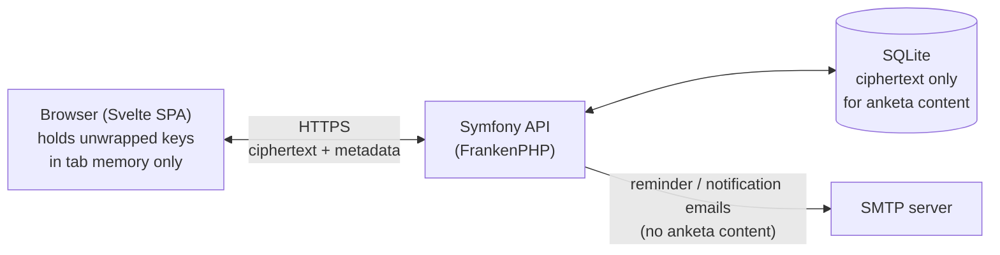

# Architecture

How the system is put together. For what the encryption actually does, see [encryption.md](encryption.md). For how to run it, see [deployment.md](deployment.md).

## Tech stack

| Layer | Choice | Notes |
|---|---|---|
| Backend | Symfony (PHP 8.4), hand-composed | No `symfony/skeleton` — deliberately fewer moving parts |
| Backend API layer | Custom controllers | Real logic per endpoint, not generic CRUD (one narrow exception below) |
| Database | SQLite | Single-tenant, self-hosted; no need for a separate DB server |
| App server | [FrankenPHP](https://frankenphp.dev/) (built on Caddy) | Serves PHP and the built frontend from one process/container |
| Frontend | Svelte 5 + TypeScript + Vite | Runes (`$state`/`$derived`/`$effect`), no SSR — a plain SPA |
| Frontend crypto | [libsodium-wrappers-sumo](https://github.com/jedisct1/libsodium.js) + WebCrypto | See encryption.md |
| Auth | Server-side session (httpOnly, `SameSite=Strict` cookie), CSRF-protected | Not JWT — no client-side token storage/refresh logic needed |
| i18n | `svelte-i18n` (frontend), Symfony Translation (backend emails/errors) | 4 languages: English, Russian, Latvian, Spanish |
| Mail | Symfony Mailer, any SMTP DSN | Mailpit in dev, real SMTP in prod |

## High-level shape



The server is a single deployable unit: one FrankenPHP process serves the built SPA's static files *and* the `/api/*` JSON endpoints, backed by one SQLite file. There's no separate frontend host, no message queue, no background worker process — see "What's deliberately not here" below for why.

## Directory layout

```
backend/
  src/Controller/    one file per resource area (Auth, Activation, Anketa, Admin, Invite, ...)
  src/Entity/         Doctrine entities (User, Anketa, Goal, ActivationToken, ...)
  src/EventListener/  cross-cutting concerns (JSON error responses, request-locale resolution)
  src/Http/           small shared helpers (e.g. rate-limit response formatting)
  src/Notification/   email-sending logic
  src/Security/       session/CSRF helpers
  tests/              PHPUnit — Functional (HTTP-level, per controller) + Unit (entity logic) + Architecture (structural rules, see below)

frontend/
  src/crypto/   every cryptographic operation — see encryption.md, this is the module to audit
  src/anketa/   the anketa domain: questions, comments, outcomes, goals (pure logic + UI)
  src/pages/    one Svelte component per route
  src/admin/    admin-only UI
  src/design/   design-system tokens/components/shared layout pieces
  src/i18n/     locale files + language switcher

docker/         Dockerfiles and Caddy configs for both dev and prod
docs/           you are here
```

## Request/session model

Every request from the frontend goes through `src/api/client.ts`, which attaches the session cookie (browser-managed, not touched by app code) and a CSRF token (fetched once, sent as a header) and an `X-Locale` header (so backend-generated error messages come back in the active UI language). The backend has no JWT issuance/refresh logic at all — a session is either valid (cookie present, not expired, account not blocked) or it isn't.

`GET /api/users` is the one resource exposed through API Platform rather than a hand-written controller — it's genuinely a plain read-only list (needed for the counterpart picker), and neither field it returns (`isAdmin`, `isBlocked`) is sensitive. Every other endpoint is a hand-written controller method with real per-request authorization logic (e.g. "is the requester a participant in this anketa"), not a generic resource pattern.

## What the server is trusted to enforce vs. what it structurally cannot see

This is the boundary the whole design sits on top of, so it's worth stating explicitly here too (full detail in encryption.md):

- **The server fully controls**: who can log in, who's an admin, who's blocked, which two accounts are paired in an anketa, rate limits, email delivery.
- **The server cannot see, even if compromised**: anketa answers, comments, outcome text, goal checkpoint text, any password, any encryption key. A small, backend test suite enforcement (`backend/tests/Architecture/SerializationBoundaryTest.php`) checks this structurally on every CI run — it fails the build if a ciphertext-bearing field ever gains a serialization group that would expose it over the API, or if a second entity ever gets wired into the generic API-Platform resource layer without the same scrutiny.
- **If the server itself is compromised**, the browser is the last line of defense: a strict Content-Security-Policy (`docker/prod/Caddyfile`, no `unsafe-inline`, `'wasm-unsafe-eval'` only because the crypto library is real WebAssembly) plus Subresource Integrity on the built JS/CSS (`frontend/scripts/inject-sri.mjs`) mean a tampered server can't silently swap out the crypto code that runs client-side without the browser refusing to execute it.

## Testing and CI

- **Backend**: PHPUnit (`composer test` — functional tests drive the real HTTP layer via `symfony/browser-kit`, unit tests cover entity logic with no kernel boot), PHPStan at max level for `src/`, level 8 for `tests/` (`composer stan`).
- **Frontend**: Vitest for pure logic (crypto primitives, report aggregation, locale key-parity), `svelte-check` + `tsc` for types, no per-component rendering tests (every UI change during development has been verified by careful code review and manual `npm run dev` passes, not automated screenshots or a component-testing harness).
- **End-to-end (Playwright)**: `frontend/e2e/` — a real dual-actor journey (two independent browser contexts, one as an employee and one as a manager) driven through the actual UI against a real running backend, not mocks: real account activation (real argon2id/X25519/AEAD crypto executing as WebAssembly in a real Chromium tab, not a Node script or PHP substitute), real anketa creation, a real cross-session publish/reveal round-trip, and a real comment. Local-only, not wired into CI — CI's jobs run natively with no live backend/Mailpit, and standing up the full dev stack inside a CI job is a separate, not-yet-built concern. Requires the dev stack running (`make up`) and, once per machine, `npx playwright install chromium`; run with `cd frontend && npm run test:e2e`.
- **CI**: GitHub Actions, two independent jobs (`backend`, `frontend`) on every push/PR, running the exact commands above (minus the Playwright suite) natively (no Docker-in-CI) — see `.github/workflows/ci.yml`. Each job also measures and enforces a minimum test-coverage threshold (backend: `pcov` + Clover XML, checked by `backend/bin/check-coverage.php`; frontend: Vitest's native `coverage.thresholds`) and ends with a dependency-vulnerability scan (`composer audit`, `npm audit --audit-level=high`) that blocks the build on a known CVE; `.github/dependabot.yml` complements this by proactively opening update PRs (composer, npm, GitHub Actions, and both Dockerfiles) before an advisory even gets filed.

## What's deliberately not here

- **No message queue / background worker.** The one recurring job (daily reminder emails) runs as a console command triggered by an external cron entry, not a persistent worker process — this app's self-hosting footprint intentionally has nothing that needs a supervisor.
- **No separate database server.** SQLite is enough for a single-tenant, one-organization deployment; a second service would be pure operational overhead for the deployments this app targets.
- **No generic CRUD/admin-panel framework.** Every endpoint does exactly what its one caller needs, which keeps the codebase small enough that the encryption claims in encryption.md can actually be verified by reading it, not just asserted.
- **No client-side key generation happening on the server, ever, for any reason** — including the automatic "create the next anketa" step on archiving, which could in principle be a tidy background job. It isn't, specifically so that no anketa key is ever even transiently generated outside a participant's own browser.
