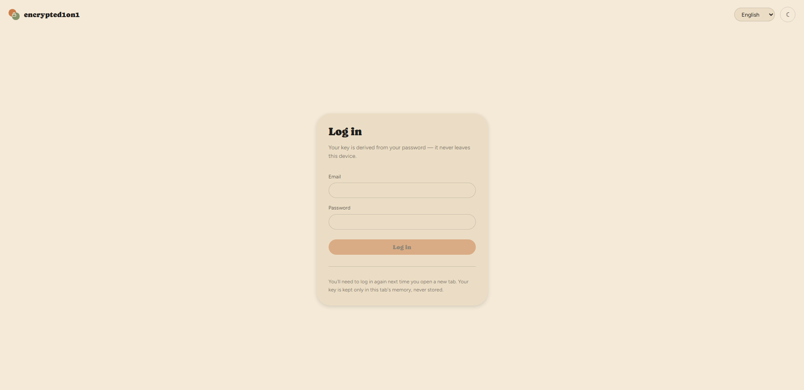
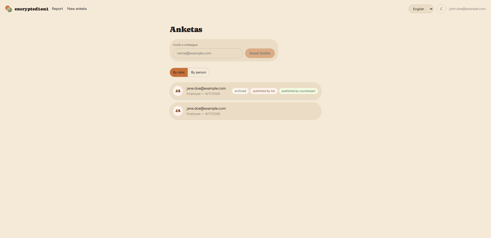
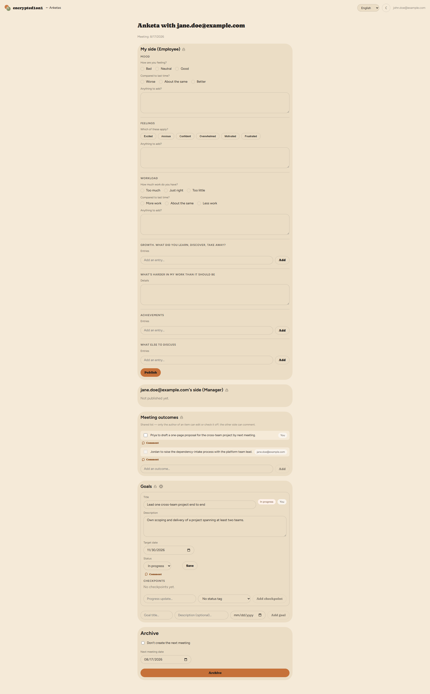
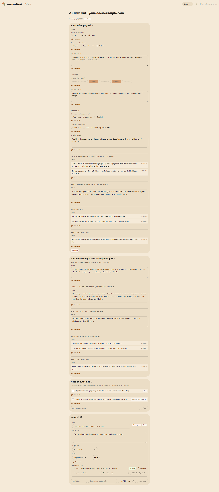
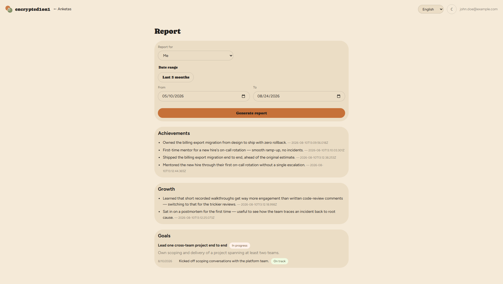
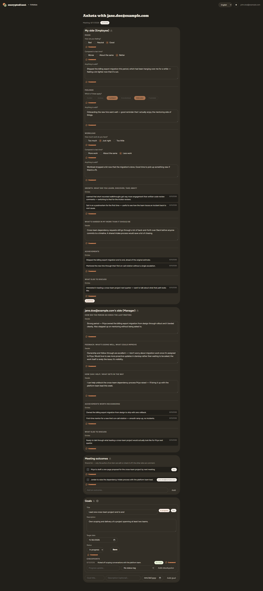
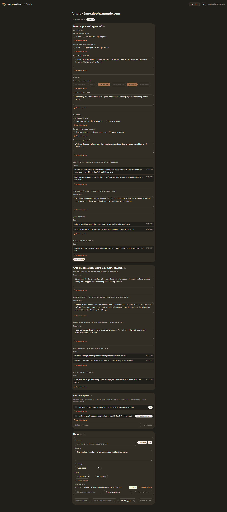
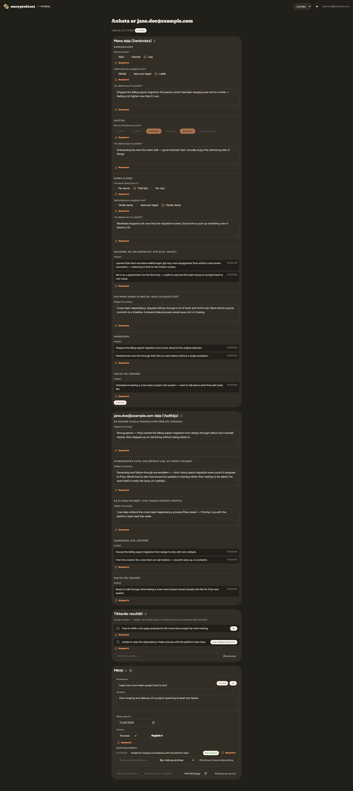
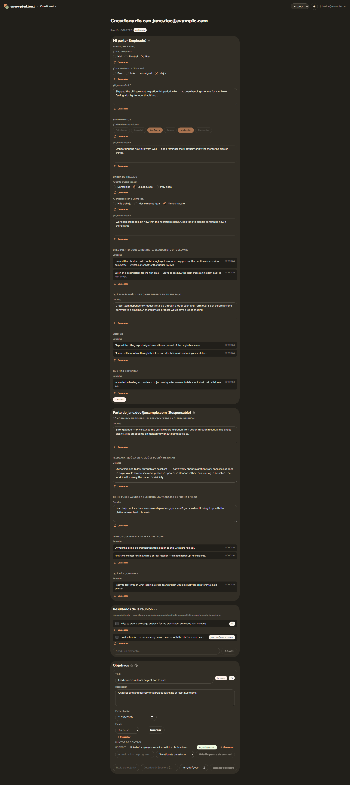
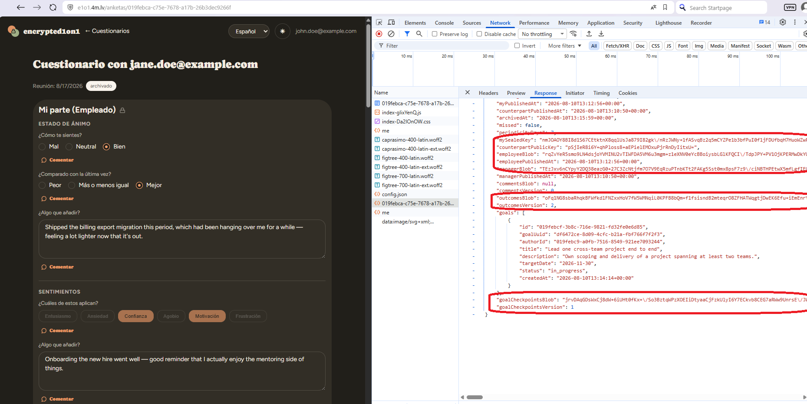

# Screenshots

A visual tour of the app, in the order you'd actually encounter it. For what each screen is doing and why, see the rest of [`docs/`](../README.md) — this page is just pictures and captions.

## Log in

Your key is derived from your password right here, client-side — the subtitle and the note at the bottom say so directly, not just in the docs. See [encryption.md](../encryption.md) for the mechanism.

## Your anketas

The home screen: an invite form (shown here since this instance is in invite mode), a by-date/by-person toggle, and each anketa tagged with its status — archived, published by me, published by my counterpart.

## Filling out an anketa

A fresh anketa, employee side, nothing filled in yet — mood/workload as radio choices, feelings as toggle pills, the append-style entry lists for growth/achievements/discuss. The counterpart's side is still locked ("Not published yet"), and archiving isn't available until there's something to archive.

The same anketa once both sides are published: real answers on both sides, meeting outcomes, and a goal with a progress checkpoint. The lock icons next to each heading are a direct, in-UI reminder of what's encrypted and what isn't (see [encryption.md](../encryption.md#the-one-deliberate-plaintext-exception) for the one exception, called out in the Goals section itself via its own "more info" toggle).

## Report

Every achievement and growth-log entry across a date range, plus goals with their full checkpoint history — assembled entirely client-side from anketas the browser already has the keys to. See [user-flow.md](../user-flow.md#reports).

## Dark mode

Dark mode is a first-class theme, not an afterthought — same anketa as above, switched via the header toggle.

## Multiple languages

The interface ships with 4 languages out of the box: English (shown above), Russian, Latvian, and Spanish.

| Russian | Latvian | Spanish |
|---|---|---|
|  |  |  |

## What the server actually sees

The point made concrete: this is the *actual* network response for the anketa above, opened in the browser's own devtools. `mySealedKey`, `employeeBlob`, `managerBlob`, `outcomesBlob`, and `goalCheckpointsBlob` (circled) are exactly what they look like — opaque ciphertext, not something that decodes into the answers shown in the screenshots above. See [encryption.md](../encryption.md) for what's actually going on here, and its threat-model section for what this does and doesn't protect against.
